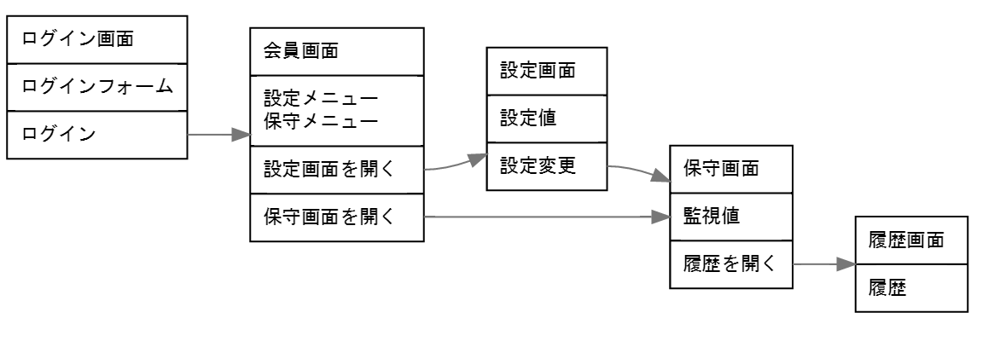

# guiflow使い方

[guiflow](https://github.com/hirokidaichi/guiflow)の使い方をまとめてみる。

## インストール
[guiflow](https://github.com/hirokidaichi/guiflow)のdownloadからzipファイルをダウンロードする。
使用するOSに対応したzipファイルをダウンロードすること。

ダウンロードしたら、解凍して「guiflow.exe」を実行する。

## UI Flows

UI Flowsは、ユーザーインタフェースを設計する際に、
画面遷移（画面の流れ）を記述する記法である。

UI設計の必要条件である下記の2点に着目して、記述する。
* ユーザーが見るもの
* ユーザーがする行動

## guiflow
guiflowはマークダウン記法で記述すると、UI Flowsを生成してくれるエディタである。

下記の記法で画面遷移を記述できる。

    [page]
    ユーザーが見るもの
    --
    ユーザーがすること
    ==> page2

    [page2]
    ユーザーが見るもの
    --
    ユーザーがすること
    ==> page4
    ユーザーがすること
    ==> page3

    [page4]
    ユーザーが見るもの

    [page3]
    ユーザーが見るもの

注意事項（[Qiita || guiflow簡単説明](https://qiita.com/nobb_hero/items/24a8ace5137efed26061)より引用）
* コピー&ペーストは禁止（Windows版のみ）。
* 遷移先が意図せず繋がる場合がある。条件は「ページ内に区切りがあり、後続行で別ページが定義されているとき」。

## サンプル
ログインして、設定、保守する画面遷移のサンプルを作成した。

### 記述内容

    [ログイン画面]
    ログインフォーム
    --
    ログイン
    ==> 会員画面

    [会員画面]
    設定メニュー
    保守メニュー
    --
    設定画面を開く
    ==> 設定画面
    保守画面を開く
    ==> 保守画面

    [設定画面]
    設定値
    --
    設定変更

    [保守画面]
    監視値
    --
    履歴を開く
    ==> 履歴画面

    [履歴画面]
    履歴

### 出力結果

## 参考

* [guiflow](https://github.com/hirokidaichi/guiflow)
* [Qiita || もう保守されない画面遷移図は嫌なので、UI Flow図を簡単にマークダウンぽく書くエディタ作った](https://qiita.com/hirokidaichi/items/ff54a968bdd7bcc50d42)
* [Qiita || guiflow簡単説明](https://qiita.com/nobb_hero/items/24a8ace5137efed26061)
* [A shorthand for designing UI flows](https://signalvnoise.com/posts/1926-a-shorthand-for-designing-ui-flows)
* [UI Flows コンパイラ](https://github.com/hirokidaichi/uiflow)

